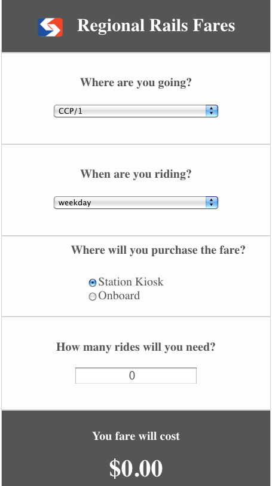

# Responsive Interactive Septa Fare Calculator Widget

When you take regional rail in and out of the city, the fare price
is affected by where you purchase the ticket, when you ride, and how
far you travel. 

You can learn more about the details on 
[SEPTA's website](http://www.septa.org/fares/ticket/index.html)
The information is compiled into this [JSON file](fares.json). 

When you change any input information, the fare is automatically recalculated.



## Getting Started

Put fares.json and septafc.html in your application top-level directory.

In your html:

- use the css/septafc.css stylesheet. 
  
- To create the widget, just set an id tag on a div:
  `<div id="septafc"></div>`
    
- Source the javascript:  
  `<script src="js/septafc.js"></script>`     

    
In your javascript on ready: 

$.('#septafc').septaFareCalculator();


### Prerequisites

You need jquery:
`<script src="https://ajax.googleapis.com/ajax/libs/jquery/1.12.4/jquery.min.js"></script>`


```


